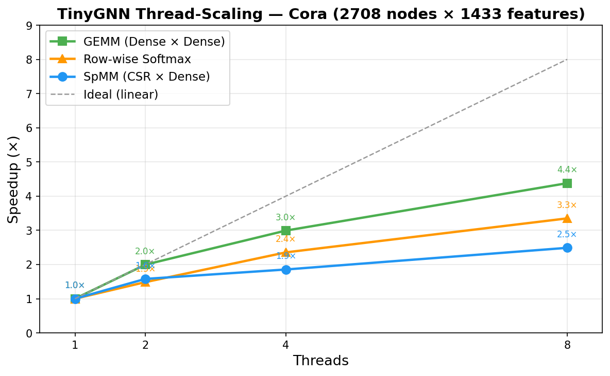

# TinyGNN

A dependency-free C++ inference engine optimized for Sparse Graph Neural Networks.

TinyGNN pivots from a dense-only deep learning runtime to a **sparse-native architecture**, demonstrating low-level systems programming, memory architecture optimizations, and parallel computing -- with zero external dependencies.

---

## Project Roadmap

| Phase | Title | Status |
|-------|-------|--------|
| 1 | Hybrid Tensor Core | Complete |
| 2 | Graph Data Loader | Complete |
| 3 | Dense Compute Kernels (GEMM) | Complete |
| 4 | Sparse Compute Kernels (SpMM) | Complete |
| 5 | Activations & Utilities | Complete |
| 6 | Multi-Architecture Layer Assembly | Complete |
| 7 | Multi-Model End-to-End Pipeline & Reference Matching | Complete |
| 8 | Python Bridge (pybind11) | Complete |
| 9 | Software-Level Parallelism (OpenMP & AVX2) | Complete |
| 10 | Operator Fusion (GAT & GraphSAGE) | Complete |
| 11 | Packaging, CI/CD & Documentation | Complete |

---

## Project Structure

```
TinyGNN/
├── CMakeLists.txt
├── setup.py                    # pybind11 Python extension build
├── pyproject.toml              # Phase 11: PEP 517/518 packaging metadata (PyPI)
├── MANIFEST.in                 # Phase 11: source distribution manifest
├── LICENSE                     # Phase 11: MIT license
├── CITATION.cff                # Phase 11: JOSS/JMLR citation metadata
├── CONTRIBUTING.md             # Phase 11: contributor guidelines
├── Doxyfile                    # Phase 11: Doxygen C++ documentation config
├── .github/
│   └── workflows/
│       └── ci.yml              # Phase 11: GitHub Actions CI/CD pipeline
├── docs/                       # Phase 11: Sphinx documentation
│   ├── conf.py                 # Sphinx configuration
│   ├── index.rst               # Documentation home page
│   ├── installation.rst        # Installation guide
│   ├── quickstart.rst          # Quick start tutorial
│   ├── python_api.rst          # Python API reference
│   ├── cpp_api.rst             # C++ API reference (Breathe + Doxygen)
│   ├── benchmarks.rst          # Benchmark results
│   └── Makefile                # Sphinx build helper
├── benchmarks/
│   ├── bench_parallel.cpp      # Phase 9: OpenMP + AVX2 thread-scaling benchmark
│   ├── bench_fusion.cpp        # Phase 10: fused vs. unfused GAT/SAGE runtime + memory
│   ├── massif_gat_fused.cpp    # Phase 10: Massif profiling (fused GAT heap)
│   ├── massif_gat_unfused.cpp  # Phase 10: Massif profiling (unfused GAT heap)
│   └── thread_scaling.png      # Phase 9: generated thread-scaling chart
├── include/
│   └── tinygnn/
│       ├── tensor.hpp          # StorageFormat enum + Tensor struct
│       ├── graph_loader.hpp    # GraphData + GraphLoader (CSV -> CSR pipeline)
│       ├── ops.hpp             # compute kernels + activations: matmul, spmm, relu, softmax, etc.
│       ├── layers.hpp          # GCN, GraphSAGE, GAT layer structs + helpers
│       └── model.hpp           # Model execution graph + binary weight/graph loaders
├── src/
│   ├── tensor.cpp
│   ├── graph_loader.cpp        # CSV parser + edge-list-to-CSR conversion
│   ├── ops.cpp                 # matmul, spmm, relu, leaky_relu, elu, sigmoid, tanh, gelu, softmax, log_softmax, add_bias
│   ├── layers.cpp              # add_self_loops, gcn_norm, GCNLayer, SAGELayer, GATLayer, edge_softmax
│   └── model.cpp               # Model::forward(), load_cora_binary(), load_weight_file()
├── python/
│   ├── tinygnn_ext.cpp         # Phase 8: pybind11 C++ bindings (280+ lines)
│   └── tinygnn/
│       └── __init__.py         # Phase 8: Python package re-exports
├── tests/
│   ├── test_tensor.cpp         # Phase 1 -- 104 assertions
│   ├── test_graph_loader.cpp   # Phase 2 -- 269 assertions
│   ├── test_matmul.cpp         # Phase 3 -- 268 assertions
│   ├── test_spmm.cpp           # Phase 4 -- 306 assertions
│   ├── test_activations.cpp    # Phase 5 -- 266 assertions
│   ├── test_gcn.cpp            # Phase 6a -- 764 assertions
│   ├── test_graphsage.cpp      # Phase 6b -- 1,011 assertions
│   ├── test_gat.cpp            # Phase 6c -- 1,284 assertions
│   ├── test_e2e.cpp            # Phase 7  -- 13,862 assertions (end-to-end pipeline)
│   └── test_python_bindings.py # Phase 8  -- 49 pytest tests (Python bridge)
├── datasets/                   # downloaded via scripts/fetch_datasets.py
│   ├── cora/                   # 2,708 nodes, 5,429 edges, 1,433 features
│   └── reddit/                 # 232,965 nodes, 114,615,892 edges, 602 features
├── weights/                    # exported by train_cora.py (gitignored)
│   ├── cora_graph.bin          # Cora graph in binary (features, labels, masks, edges)
│   ├── gcn_cora.bin            # GCN trained weights (~78% test accuracy)
│   ├── sage_cora.bin           # GraphSAGE trained weights (~81% test accuracy)
│   └── gat_cora.bin            # GAT trained weights (~80% test accuracy)
└── scripts/
    ├── install_wsl_tools.sh    # one-time WSL tooling setup
    ├── fetch_datasets.py       # download Cora + Reddit, convert to CSV
    ├── train_cora.py           # PyG training: GCN/SAGE/GAT → binary weight export
    ├── validate_cora.py        # PyG ↔ TinyGNN logit-level comparison
    ├── plot_scaling.py         # thread-scaling chart generator (matplotlib)
    ├── run_massif_phase9.sh    # Massif memory profiling (fused vs unfused)
    ├── build_python.py         # build Python extension + run tests
    ├── sanitizers.sh           # ASan + UBSan (27 configs, all phases)
    └── valgrind_all.sh         # Memcheck + Helgrind + Callgrind (all phases)
```

---

## Installation

### Quick Install (PyPI)

The simplest way to install TinyGNN:

```bash
pip install tinygnn
```

### Install from Source (Development)

```bash
git clone https://github.com/JaiAnshSB/TinyGNN.git
cd TinyGNN
pip install -e ".[dev]"
```

This builds the C++ extension in-place and installs development dependencies.

### Python Usage

```python
import tinygnn
import numpy as np

# Create tensors from NumPy
X = tinygnn.Tensor.from_numpy(np.random.randn(10, 16).astype(np.float32))
print(f"Shape: {X.rows} x {X.cols}")  # 10 x 16

# Build a GCN model
model = tinygnn.Model()
model.add_gcn_layer(1433, 64, activation=tinygnn.Activation.RELU)
model.add_gcn_layer(64, 7, activation=tinygnn.Activation.NONE)
model.load_weights("weights/gcn_cora.bin")

# Run inference
cora = tinygnn.load_cora_binary("weights/cora_graph.bin")
logits = model.forward(cora.adjacency, cora.features)
predictions = logits.to_numpy().argmax(axis=1)
print(f"Predicted classes: {np.unique(predictions)}")
```

### C++ Only (No Python)

#### Prerequisites
- C++17-capable compiler (GCC 8+, Clang 7+, MSVC 2019+)
- CMake 3.16+  *(optional -- g++ directly also works)*
- OpenMP (usually bundled with GCC; optional but recommended for parallelism)
- CPU with AVX2 + FMA support (Intel Haswell+ / AMD Zen+; optional, scalar fallback provided)

#### With CMake
```bash
cmake -S . -B build -DCMAKE_BUILD_TYPE=Release
cmake --build build --config Release --parallel
ctest --test-dir build --output-on-failure --config Release
```

#### Directly with g++ (example)
```bash
# All tests at once (with OpenMP + AVX2)
g++ -std=c++17 -O2 -fopenmp -mavx2 -mfma -Wall -Wextra -I include \
    src/tensor.cpp src/graph_loader.cpp src/ops.cpp src/layers.cpp src/model.cpp \
    tests/test_tensor.cpp -o build/test_tensor && ./build/test_tensor
```

### Python Extension
```bash
pip install -e ".[dev]"                                   # development install
python -m pytest tests/test_python_bindings.py -v         # run Python tests
python scripts/validate_cora.py --logit-check             # PyG logit comparison
```

### Benchmarks
```bash
# Thread-scaling (OpenMP + AVX2)
cmake --build build --target bench_parallel && ./build/bench_parallel

# Operator fusion (fused vs unfused GAT/SAGE)
cmake --build build --target bench_fusion && OMP_NUM_THREADS=8 ./build/bench_fusion

# Massif memory profiling (requires Valgrind on Linux)
bash scripts/run_massif_phase9.sh
```

### Memory Safety (WSL / Linux)
```bash
bash scripts/sanitizers.sh       # 27 sanitizer configs across all phases
bash scripts/valgrind_all.sh     # Memcheck + Helgrind + Callgrind
```

### Building Documentation
```bash
# C++ API docs (Doxygen)
doxygen Doxyfile                 # → docs/doxygen/html/index.html

# Python docs (Sphinx)
pip install sphinx sphinx-rtd-theme breathe
cd docs && make html             # → docs/_build/html/index.html
```

### CI/CD

Every push to `main` and every pull request automatically triggers GitHub Actions:
- **C++ build + test** on Linux (GCC + Clang), macOS, and Windows (MSVC)
- **Python build + test** on Linux, macOS, Windows (Python 3.10 + 3.12)
- **ASan + UBSan** sanitizer checks on Linux
- **Documentation build** (Doxygen + Sphinx)

---

## Datasets

TinyGNN tests against two real-world graph datasets. Download them with the included Python script:

```bash
# Cora only (no extra Python deps, ~170 KB download)
python3 scripts/fetch_datasets.py --cora-only

# Both Cora and Reddit (needs numpy + scipy, ~200 MB download)
pip install numpy scipy
python3 scripts/fetch_datasets.py
```

| Dataset | Source | Nodes | Edges | Features | CSV size |
|---------|--------|-------|-------|----------|----------|
| Cora | LINQS (McCallum et al. 2000) | 2,708 | 5,429 | 1,433 (binary bag-of-words) | 7.5 MB |
| Reddit | DGL / GraphSAGE (Hamilton et al. 2017) | 232,965 | 114,615,892 | 602 (GloVe embeddings) | 2.7 GB |

Files are placed in `datasets/cora/` and `datasets/reddit/` (gitignored).
Tests that require actual datasets skip gracefully when the files are not present.

---

## Phase 1 -- Hybrid Tensor Core

### Goal
Establish the fundamental data structure by expanding a contiguous memory design to support both dense and sparse graph layouts, without any third-party libraries.

### Design

#### StorageFormat enum
```cpp
enum class StorageFormat : uint8_t {
    Dense     = 0,   // Row-major contiguous storage
    SparseCSR = 1    // Compressed Sparse Row
};
```

#### Tensor struct layout

```
Dense:
  data_    -> [v00, v01, ..., v(R-1)(C-1)]   rows*cols floats, row-major
  strides_ -> {cols, 1}

SparseCSR:
  row_ptr_ -> size (rows+1)   row_ptr[i]..row_ptr[i+1] = col indices of row i
  col_ind_ -> size nnz        column index of each non-zero
  data_    -> size nnz        value of each non-zero
```

#### Memory footprint

| Format | Formula | 1000x1000 example |
|--------|---------|-------------------|
| Dense | rows * cols * 4 bytes | 4,000,000 bytes (3.8 MB) |
| SparseCSR | nnz*4 + nnz*4 + (rows+1)*4 bytes | 44,004 bytes with 5000 edges (43 KB) |

Sparse uses ~1.1% of the memory of the equivalent dense matrix in this benchmark.

### Results

```
Dense  1000x1000 memory          = 4,000,000 bytes
Sparse 1000x1000 (5000 nnz)      =    44,004 bytes
Memory ratio (sparse / dense)    =      1.10%
Very sparse (10 nnz in 10k x10k) =      0.01%
```

### Test suite -- 104 assertions, 18 test functions, 0 failures

| Category | Functions |
|----------|-----------|
| Dense construction and mutation | 3 |
| Memory footprint validation | 2 |
| Memory comparison / reduction ratios | 2 |
| Edge cases (empty, 1x1, 0-nnz, degenerate shapes, CSR data integrity) | 6 |
| Error handling (invalid args, out-of-bounds, wrong format access) | 4 |
| Utility (repr, enum values) | 1 |

```
Total : 104
Passed: 104
Failed: 0
```

---

## Phase 2 -- Graph Data Loader

### Goal
Load irregular graph structures from CSV files and convert them to hardware-friendly sorted CSR format, ready for GNN inference.

### Design

#### GraphLoader class
```cpp
class GraphLoader {
public:
    // Edge-list CSV  ->  vector of (src, dst) pairs
    static std::vector<std::pair<int32_t, int32_t>>
        parse_edges(const std::string& path);

    // Feature CSV  ->  Dense tensor (num_nodes x num_features)
    static Tensor parse_features(const std::string& path);

    // Raw edge list  ->  sorted SparseCSR adjacency tensor
    static Tensor edge_list_to_csr(
        const std::vector<std::pair<int32_t, int32_t>>& edges,
        std::size_t num_nodes);

    // Full pipeline: CSV files  ->  GraphData (adjacency + features)
    static GraphData load(const std::string& edges_path,
                          const std::string& features_path);
};
```

#### CSR conversion algorithm -- O(E + V + E*log(E/V))

```
Step 1: Count out-degree per node         O(E)
Step 2: Build row_ptr via prefix sum      O(V)
Step 3: Fill col_ind via offset cursors   O(E)
Step 4: Sort col_ind within each row      O(E*log(E/V)) amortised
```

#### CSV format support
- Automatic header row detection (skips non-numeric first lines)
- Both LF and CRLF line endings
- Whitespace-tolerant parsing
- Out-of-order node IDs with gap zero-filling in feature tensor

### Results (Cora-scale synthetic benchmark)

```
Nodes:     2,708
Edges:     10,556
Features:  1,433 per node

Adjacency: Tensor(2708x2708, SparseCSR, 95,284 bytes)
Features:  Tensor(2708x1433, Dense, 15,522,256 bytes)
```

### Results (Reddit-scale synthetic benchmark)

Reddit (Hamilton et al. 2017, GraphSAGE paper): 232,965 nodes, 114,615,892 directed edges, 602 features.
Generated synthetically with a fixed seed; full file pipeline writes ~1.4 GB edge CSV + ~282 MB feature CSV.

```
Nodes:     232,965
Edges:     114,615,892
Features:  602 per node

Adjacency: Tensor(232965x232965, SparseCSR, 917,859,000 bytes)  (~875 MB)
Features:  Tensor(232965x602,   Dense,      560,979,720 bytes)  (~535 MB)

In-memory CSR algorithm test:
  Edge generation (114M pairs):   1,350 ms
  CSR construction + sort:        5,591 ms
  Total:                          6,979 ms

Full file-pipeline test:
  Edge file write (1.4 GB):      25,491 ms
  Feature file write (282 MB):    3,748 ms
  GraphLoader::load():          119,047 ms
  Total:                        148,286 ms

Node 0 neighbors: 455 (CSR traversal matches raw CSV exactly)
```

### Results (actual Cora dataset)

The real Cora citation network (McCallum et al. 2000): 2,708 papers linked by 5,429 directed citations, with 1,433 binary bag-of-words features per paper.

```
Nodes:     2,708
Edges:     5,429
Features:  1,433 per node (binary)

Adjacency: Tensor(2708x2708, SparseCSR, 54,268 bytes)     (~53 KB)
Features:  Tensor(2708x1433, Dense,     15,522,256 bytes)  (~14.8 MB)

Feature density: 49,216 / 3,880,564 entries are 1  (1.27%)
Node 0 neighbors: 3 (CSR traversal matches raw CSV exactly)
```

### Results (actual Reddit dataset)

The real Reddit post network (Hamilton et al. 2017, GraphSAGE): 232,965 posts linked by 114,615,892 directed edges, with 602-dimensional GloVe word embeddings per post.

```
Nodes:     232,965
Edges:     114,615,892
Features:  602 per node (GloVe float)

Adjacency: Tensor(232965x232965, SparseCSR, 917,859,000 bytes)  (~875 MB)
Features:  Tensor(232965x602,   Dense,      560,979,720 bytes)  (~535 MB)

GraphLoader::load() time: 157 s  (WSL, Ubuntu 24.04, GCC 13.3)
Node 0 neighbors: 2,204
```

### Test suite -- 269 assertions, 49 test functions, 0 failures

| Category | Functions | Covers |
|----------|-----------|--------|
| Edge CSV parsing | 6 | header, no-header, CRLF, self-loops, trailing blanks |
| Feature CSV parsing | 6 | ordered, unordered, sparse IDs, negative values |
| CSR conversion | 8 | exact arrays, sort invariant, empty rows, memory footprint |
| Full load pipeline | 4 | node-0 neighbors, all-nodes verify, feature zero-expansion |
| Cora-scale validation | 3 | 2708 nodes / 10556 edges / 1433 features / row_ptr invariants |
| Reddit-scale validation | 4 | 232,965 nodes / 114,615,892 edges / in-memory CSR + full pipeline + node-0 match |
| Actual Cora dataset | 4 | 2,708 nodes / 5,429 real citation edges / binary features / node-0 match |
| Actual Reddit dataset | 4 | 232,965 nodes / 114,615,892 real edges / GloVe features / CSR invariants |
| Error handling | 10 | file-not-found, malformed lines, negative IDs, out-of-range |

```
Total : 269
Passed: 269
Failed: 0
```

---

## Phase 3 -- Dense Compute Kernels (GEMM)

### Goal
Implement the baseline dense matrix multiplication needed for the GNN feature transformation H' = H x W, where H is the node feature matrix and W is the learned weight matrix.

### Design

#### matmul function
```cpp
// C = A x B
// A: Dense (M x K)   B: Dense (K x N)   C: Dense (M x N), newly allocated
Tensor matmul(const Tensor& A, const Tensor& B);
```

#### Loop order -- (i, k, j)

The implementation uses the **(i, k, j)** traversal order rather than the naive (i, j, k):

```
for i in [0, M):           // row of A and C
  for k in [0, K):         // shared dimension
    a_ik = A[i][k]         // hoisted into scalar register
    for j in [0, N):       // row of B, column of C
      C[i][j] += a_ik * B[k][j]
```

**Why (i, k, j):** `A[i][k]` is loop-invariant across the inner j-loop and lives in a register. `B[k][j]` is accessed row-sequentially (cache-friendly). The compiler can auto-vectorise the inner j-loop because the scalar `a_ik` eliminates a load dependency. `__restrict__` pointers are used to communicate the no-aliasing guarantee to the compiler.

#### Complexity

| Metric | Value |
|--------|-------|
| Time complexity | O(M * K * N) |
| FLOPs | 2 * M * K * N (1 multiply + 1 add per A element) |
| Output allocation | M * N * 4 bytes |

#### Preconditions enforced
- Both operands must be StorageFormat::Dense (sparse-dense SpMM is Phase 4)
- A.cols() must equal B.rows() -- throws std::invalid_argument with both dimensions in the message
- Zero-dimension tensors produce a valid zero-filled output

### Results

```
matmul(128x128, 128x128)         =    1 ms
matmul(1024x32, 32x256)          =    4 ms  (output = 1024 KB)
matmul(256x256, I_256)           spot checks: 8/8 pass
matmul(5x8, 8x6) footprint       = 120 bytes (5*6*4)
```

GNN feature transform (H x W, one-hot nodes selecting rows of W):

```
H (3x4)  x  W (4x2)  ->  H' (3x2)
Node 0: [1, 2]   Node 1: [3, 4]   Node 2: [5, 6]
```

4x4 hardcoded result (spec required):

```
A = reshape([1..16], 4, 4)    B = reshape([17..32], 4, 4)

C = A x B:
  [  250,  260,  270,  280 ]
  [  618,  644,  670,  696 ]
  [  986, 1028, 1070, 1112 ]
  [ 1354, 1412, 1470, 1528 ]
```

### Test suite -- 268 assertions, 30 test functions, 0 failures

| Category | Functions | Covers |
|----------|-----------|--------|
| 4x4 hardcoded result (spec) | 3 | full matrix, element spot-checks, 2x2 sub-block cross-check |
| Non-square shapes | 3 | (2x3)x(3x4), matrix x column-vector, row-vector x matrix |
| Identity and zero properties | 4 | A*I=A, I*A=A, non-square identity, zero matrix output |
| GNN feature transform | 1 | H x W with one-hot nodes verifying row selection from W |
| Algebraic properties | 3 | non-commutativity, associativity, scalar distributivity |
| Output tensor properties | 3 | format=Dense, shape MxN, footprint = M*N*4 bytes |
| Stress / scale | 3 | 128x128 all-ones, 1024x32x256 rectangle, 256x256 identity |
| Dimension mismatch errors | 5 | basic throw, message content, 4 bad-shape combos, degenerate 0-dim |
| Sparse input errors | 2 | sparse A throws, sparse B throws (SparseCSR in message) |
| Edge / degenerate cases | 3 | 1x1 scalar, all-zeros output, GNN layer chain (AB)C = A(BC) |

```
Total : 268
Passed: 268
Failed: 0
```

---

## Phase 4 -- Sparse Compute Kernels (SpMM)

### Goal
Implement the sparse-dense matrix multiplication kernel that is the heart of GNN message-passing: `H_agg = Adj × H`, aggregating each node's neighbor features via the sparse adjacency matrix.

### Design

#### spmm function
```cpp
// C = A × B
// A: SparseCSR (M × K)   B: Dense (K × N)   C: Dense (M × N), newly allocated
Tensor spmm(const Tensor& A, const Tensor& B);
```

#### Algorithm -- CSR-SpMM

```
for i in [0, M):                        // row of A (node)
  for nz in [row_ptr[i], row_ptr[i+1]): // non-zeros in row i (neighbors)
    k = col_ind[nz]                     // column (neighbor node ID)
    a_val = data[nz]                    // edge weight (1.0 for unweighted)
    for j in [0, N):                    // feature dimension
      C[i][j] += a_val * B[k][j]       // accumulate neighbor's features
```

**Why CSR-SpMM:** The outer loop walks rows (nodes). The middle loop walks non-zero columns (graph neighbors) — this *is* the message-passing. The inner loop accumulates dense features — cache-friendly because `B[k][j]` is contiguous in memory and the compiler can auto-vectorise with the scalar `a_val` hoisted to a register.

#### Complexity

| Metric | Value |
|--------|-------|
| Time complexity | O(nnz × N) — proportional to edges × features |
| FLOPs | 2 × nnz × N (1 multiply + 1 add per edge per feature) |
| Output allocation | M × N × 4 bytes |

#### Preconditions enforced
- A must be StorageFormat::SparseCSR (Dense A → "use matmul() instead")
- B must be StorageFormat::Dense (Sparse B → "Sparse × Sparse not supported")
- A.cols() must equal B.rows() — throws std::invalid_argument with dimensions in message
- Early exit for degenerate cases (M=0, N=0, or nnz=0) producing valid zero-filled output

### Results

3×3 hand-calculated SpMM (spec required):
```
A (SparseCSR):                   B (Dense):
  [1 1 0]  row_ptr=[0,2,3,5]      [1 2]
  [0 1 0]  col_ind=[0,1,1,0,2]    [3 4]
  [1 0 1]  values =[1,1,1,1,1]    [5 6]

C = spmm(A, B):
  [4, 6]   ← 1·[1,2] + 1·[3,4]
  [3, 4]   ← 1·[3,4]
  [6, 8]   ← 1·[1,2] + 1·[5,6]
```

4×4 weighted hand-calculated:
```
A (SparseCSR):                B (Dense):
  [2 0 0 0]  values=[2,3,     [1  0  2]
  [0 3 1 0]   1,1,2,1,1]      [0  1  0]
  [1 0 0 2]                    [3  0  1]
  [0 1 1 0]                    [0  2  0]

C = spmm(A, B):
  [2, 0, 4]  [3, 3, 1]  [1, 4, 2]  [3, 1, 1]
```

GNN message-passing (star graph, 5 nodes):
```
H_agg = spmm(Adj_star, H)
  Hub (node 0): sum of all features = [10, 40]
  Leaf i:       H[0] + H[i]  (receives from hub + self)
```

Equivalence with dense matmul verified for:
- 32×32 sparse (~9% density) × 32×16 dense
- Cora-scale: 2,708×2,708 sparse (3 nnz/row) × 2,708×32 dense

### Test suite -- 306 assertions, 35 test functions, 0 failures

| Category | Functions | Covers |
|----------|-----------|--------|
| 3×3 hand-calculated (spec) | 3 | full matrix, element checks, column vector |
| 4×4 weighted CSR | 2 | full result, element derivations |
| Non-square shapes | 3 | (5×3)×(3×4), (2×5)×(5×1), (1×4)×(4×3) |
| Identity & zero properties | 4 | sparse I × B = B, 64×64, zero-nnz, all-ones |
| GNN message-passing | 3 | triangle (fully connected), star graph, two-hop path chain |
| Dense matmul equivalence | 2 | small 3×3, medium 32×32 deterministic sparse |
| Output tensor properties | 3 | format=Dense, shape M×N, memory footprint |
| Stress / scale | 3 | 512×512 identity, 2708-node Cora-scale, 1024×128 |
| Wrong format errors | 4 | dense A throws, message check, sparse B throws, message check |
| Dimension mismatch | 3 | basic throw, message "dimension mismatch", multiple combos |
| Edge / degenerate cases | 5 | single nnz, empty rows, diagonal/self-loops, negative weights, 1×1 |

```
Total : 306
Passed: 306
Failed: 0
```

---

## Phase 5 -- Activations & Utilities

### Goal
Implement the element-wise activation functions and utilities needed between GNN layers: `H' = Activation(Adj × H × W + b)`.  These operate in-place on Dense tensors for zero-copy efficiency.

### Design

#### Activation functions

| Function | Formula | GNN Use Case |
|----------|---------|--------------|
| `relu_inplace(X)` | max(0, x) | GCN, GraphSAGE, GIN — standard hidden layer activation |
| `leaky_relu_inplace(X, α)` | x if x≥0, else αx (default α=0.01) | GAT attention coefficients (α=0.2) |
| `elu_inplace(X, α)` | x if x≥0, else α(eˣ−1) (default α=1.0) | EGNN, PNA — smooth negative region |
| `sigmoid_inplace(X)` | 1/(1+e⁻ˣ) | GGNN gating, link prediction, binary classification |
| `tanh_inplace(X)` | tanh(x) | GRU/LSTM graph networks (GGNN, MPNN) |
| `gelu_inplace(X)` | x·Φ(x) ≈ 0.5x(1+tanh(√(2/π)(x+0.044715x³))) | GPS, Graphormer, TokenGT — transformer GNNs |
| `softmax_inplace(X)` | row-wise softmax with max-subtraction stability | GAT attention normalization, classification output |
| `log_softmax_inplace(X)` | row-wise log-softmax (numerically stable) | NLL loss for node classification |

#### Utility functions

| Function | Operation | GNN Use Case |
|----------|-----------|--------------|
| `add_bias(X, bias)` | X[i][j] += bias[0][j] — broadcast (1×N) across M rows | Linear layer bias: H' = AHW + b |

#### Common properties
- All activations modify the tensor **in-place** (O(1) extra memory)
- All validate **Dense format** and throw `std::invalid_argument` on SparseCSR
- Softmax / log-softmax use the **max-subtraction trick** for numerical stability
- Sigmoid uses a **two-branch implementation** (x≥0 vs x<0) to prevent overflow
- GELU uses the **tanh approximation** (same as PyTorch `F.gelu(approximate='tanh')`)

#### Complexity

| Function | Time | Extra Memory |
|----------|------|-------------|
| relu, leaky_relu, sigmoid, tanh | O(M × N) | O(1) |
| elu, gelu | O(M × N) with exp/tanh on subset | O(1) |
| softmax, log_softmax | O(M × N) — 3 passes per row | O(1) |
| add_bias | O(M × N) | O(1) |

### Results

GCN layer pipeline (identity Adj, 3 nodes, 2 features):
```
H' = ReLU(Adj × H × W + b)
  Node 0: [1.5, 0.0]   (relu clamps negative bias-shifted value)
  Node 1: [2.5, 0.0]
  Node 2: [3.5, 0.0]
```

GAT-style attention (LeakyReLU + Softmax):
```
Scores:  [0.5, -0.3, 1.2]
LeakyReLU(α=0.2): [0.5, -0.06, 1.2]
Softmax: attention weights sum to 1.0, largest score gets most weight
```

Node classification (Log-Softmax for NLL loss):
```
3 nodes × 4 classes
All log-probabilities ≤ 0, exp(row) sums to 1.0
Argmax preserved through log-softmax
```

Numerical stability verified:
```
softmax([1000, 1001])     — no NaN/Inf, correct probabilities
log_softmax([1000, 1001, 999]) — no NaN/Inf, exp sums to 1.0
```

### Test suite -- 266 assertions, 70 test functions, 0 failures

| Category | Functions | Covers |
|----------|-----------|--------|
| ReLU | 5 | basic, 2D matrix, all-positive, all-negative, zero preservation |
| Leaky ReLU | 5 | default α=0.01, GAT α=0.2, 2D, α=0→ReLU, α=1→identity |
| ELU | 4 | basic, custom α=2.0, saturation at −α, 2D mixed signs |
| Sigmoid | 5 | basic values, σ(x)+σ(−x)=1 symmetry, bounds (0,1), hand-calculated, 2D |
| Tanh | 5 | basic, odd symmetry, bounds (−1,1), hand-calculated, 2D |
| GELU | 4 | basic (0→0, large→x, neg→0), hand-calculated vs reference, zero symmetry, 2D |
| Softmax | 7 | row sums=1, bounds [0,1], uniform dist, hand-calculated, multi-row, numerical stability, argmax preserved |
| Log-Softmax | 6 | exp sums=1, all ≤ 0, consistent with softmax, uniform, numerical stability, multi-row |
| Add bias | 6 | basic broadcasting, zero bias, negative bias, single-row, wrong-rows throw, wrong-cols throw |
| GNN pipeline integration | 3 | full GCN layer, GAT attention, node classification |
| Error handling (SparseCSR) | 10 | all 9 activations + add_bias reject sparse input |
| Stress / scale | 5 | relu 1024×256, softmax 1024×128, sigmoid 512×512, bias 2708×32, gelu 256×256 |
| Edge / degenerate | 5 | 1×1 through all activations, zero-cols rejected, zero-rows no-op, double-apply idempotency |

```
Total : 266
Passed: 266
Failed: 0
```

---

## Phase 6 -- Multi-Architecture Layer Assembly

### Goal
Assemble complete GNN layer architectures from the tensor primitives built in Phases 1–5, implementing the three canonical propagation strategies: GCN (spectral normalization), GraphSAGE (inductive mean/max aggregation), and GAT (attention-based message passing).

### Design

#### Helper functions
```cpp
// Â = A + I  — insert identity self-loops into CSR (two-pass: detect diag, rebuild)
Tensor add_self_loops(const Tensor& A);

// D̃^(-1/2) Â D̃^(-1/2)  — symmetric GCN normalization
Tensor gcn_norm(const Tensor& A);

// Row-wise sparse softmax over CSR non-zeros only (max-subtract, two-pass)
Tensor edge_softmax(const Tensor& A);

// Element-wise max pooling over CSR neighborhoods
Tensor sage_max_aggregate(const Tensor& A, const Tensor& H);
```

#### GCN Layer (`GCNLayer`)
*Kipf & Welling, ICLR 2017*
```
H' = σ( Â_norm · (H · W) + b )

  ̂   precomputed by gcn_norm():  D̃^(-1/2) (A+I) D̃^(-1/2)
A = precomputed
Forward:
  Step 1: HW  = matmul(H, W)       [N × F_in] × [F_in × F_out] → [N × F_out]
  Step 2: out = spmm(Â_norm, HW)  sparse message-passing
  Step 3: add_bias(out, b)           optional
  Step 4: σ(out)                     ReLU or None
```

#### GraphSAGE Layer (`SAGELayer`)
*Hamilton, Ying & Leskovec, NeurIPS 2017*
```
h_v' = σ( W_neigh · AGG({h_u : u ∈ N(v)}) + W_self · h_v + b )

AGG variants:
  Mean: spmm(A, H) / degree[v]             (normalized neighbor sum)
  Max:  element-wise max over CSR row       (sage_max_aggregate)

Forward:
  Step 1: agg    = Mean-spmm or sage_max_aggregate
  Step 2: h_neigh = matmul(agg, W_neigh)
  Step 3: h_self  = matmul(H,   W_self)
  Step 4: out    = h_neigh + h_self        (element-wise add)
  Step 5: add_bias(out, b)                 optional
  Step 6: σ(out)                            ReLU or None
```

#### GAT Layer (`GATLayer`)
*Veličković et al., ICLR 2018*
```
Forward (single attention head):
  Step 1: Wh          = matmul(H, W)                     [N × F_out]
  Step 2: src[i]      = a_l · Wh[i],  dst[j] = a_r · Wh[j]   per node
  Step 3: e_ij        = LeakyReLU(src[i] + dst[j])       SpSDDMM — one value per CSR edge
  Step 4: α           = edge_softmax(e_csr)               sparse softmax per row
  Step 5: out         = spmm(α, Wh) + b                  attention-weighted aggregation
  Step 6: σ(out)

Weights: W (F_in×F_out), a_l (1×F_out), a_r (1×F_out), b (1×F_out)
A must include self-loops (use add_self_loops before forward).
```

### Phase 6a: GCN Layer

#### Test suite -- 764 assertions, 68 test functions, 0 failures

| Category | Tests | Covers |
|----------|-------|--------|
| add_self_loops | 7 | basic, already-has-diagonal, empty |
| gcn_norm | 7 | hand-verified D̃^(-1/2) Â D̃^(-1/2) values |
| GCNLayer construction + weight management | 8 | shape checks, wrong-format, wrong-shape throws |
| GCNLayer forward — 3-node hand-computed | 6 | row-by-row numerical verification |
| GCNLayer forward — no bias, no activation | 5 | identity propagation |
| Two-layer GCN stacking | 4 | output shape and feature composition |
| 10-node ring graph — full pipeline | 11 | symmetry, degree normalization, activation |
| Error handling | 12 | wrong formats, dimension mismatches, error messages |
| Edge / degenerate cases | 8 | single node, isolated nodes, identity adjacency |

```
Total : 764
Passed: 764
Failed: 0
```

### Phase 6b: GraphSAGE Layer

#### Test suite -- 1,011 assertions, 60 test functions, 0 failures

| Category | Tests | Covers |
|----------|-------|--------|
| sage_max_aggregate | 8 | basic, empty graph, single node |
| SAGELayer construction + weight management | 9 | shape checks, aggregator type, wrong-format throws |
| SAGELayer Mean forward — 3-node hand-computed | 7 | degree normalization, W_neigh/W_self combination |
| SAGELayer Max forward — 3-node hand-computed | 7 | max pooling, W_neigh/W_self combination |
| Multi-layer GraphSAGE | 4 | two-layer composition, feature dimension flow |
| 10-node graph tests | 7 | mean vs max comparison, scale, bias/activation |
| Error handling | 10 | dense A, sparse H, dimension mismatches, messages |
| Edge / degenerate cases | 8 | isolated nodes get zero aggregation |

```
Total : 1011
Passed: 1011
Failed: 0
```

### Phase 6c: GAT Layer

#### Test suite -- 1,284 assertions, 60 test functions, 0 failures

| Category | Tests | Covers |
|----------|-------|--------|
| edge_softmax | 10 | row sums = 1, uniform input, single-entry rows, numerical stability |
| GATLayer construction + weight management | 12 | shape checks, wrong-format, wrong-shape throws |
| GATLayer forward — 3-node hand-computed | 10 | attention score computation, softmax, weighted SpMM |
| GATLayer forward — bias and activation | 8 | bias add, ReLU gate |
| Multi-layer GAT + mixed layer stacking | 6 | GAT→GAT, GCN→GAT, SAGEMax→GAT compositions |
| Larger graph tests (10-node, 100-node) | 8 | scale, output shape, attention normalization |
| Error handling | 10 | wrong formats, dimension mismatches, negative slope validation |
| Edge / degenerate cases | 6 | self-loop-only, single node, all-zero attention |

```
Total : 1284
Passed: 1284
Failed: 0
```

---

## Phase 7 -- Multi-Model End-to-End Pipeline & Reference Matching

### Goal
Close the loop from training to inference: train three GNN architectures (GCN, GraphSAGE, GAT) on the standard Cora citation dataset using PyTorch Geometric, export their FP32 weights to a custom binary format, and validate that TinyGNN's C++ inference engine reproduces the same classification accuracy.

### Architecture

#### Python Training Pipeline (`scripts/train_cora.py`)
- Loads Cora from PyG's `Planetoid` dataset (2,708 nodes, 10,556 directed edges, 1,433 features, 7 classes)
- Trains three models with early stopping on validation accuracy:
  - **GCN**: 2-layer, 1433 → 64 → 7, ReLU, dropout 0.5
  - **GraphSAGE**: 2-layer Mean aggregation, 1433 → 64 → 7, ReLU, dropout 0.5
  - **GAT**: 2-layer, 8 heads × 8 features (concat) → 7 (single head), ELU, dropout 0.6
- Exports binary graph data and per-model weight files

#### Binary Format
**Graph data** (`cora_graph.bin`):
```
num_nodes, num_features, num_classes, num_edges  (4 × uint32)
features   (N × F × float32, row-major)
labels     (N × int32)
train_mask, val_mask, test_mask  (N × uint8 each)
edge_src, edge_dst  (E × int32 each)
```

**Weight files** (`{gcn,sage,gat}_cora.bin`):
```
Magic "TGNN"  (4 bytes)
Version       (uint32 = 1)
TestAccuracy  (float32)
NumTensors    (uint32)
─ per tensor ─
NameLen (uint32) | Name (bytes) | Rows (uint32) | Cols (uint32) | Data (float32[])
```

#### C++ Model Class (`model.hpp` / `model.cpp`)

The `Model` class implements a **dynamic execution graph** that chains heterogeneous GNN layers:

```cpp
Model model;
model.add_gcn_layer(1433, 64, true, Activation::ReLU);
model.add_gcn_layer(64, 7, true, Activation::None);
model.load_weights("weights/gcn_cora.bin");
Tensor logits = model.forward(adjacency, features);
```

Key features:
- **Heterogeneous layer support**: GCN, SAGE, and GAT layers can be freely mixed in a single execution graph
- **Multi-head GAT**: multiple independent `GATLayer` instances per logical layer, with concat or average aggregation
- **Automatic adjacency preprocessing**: `gcn_norm()` for GCN layers, raw adjacency for SAGE, `add_self_loops()` for GAT — computed once and cached
- **Inter-layer activations**: ELU, ReLU, or None applied between layers (separate from each layer's internal activation)

#### Weight Mapping (PyG → TinyGNN)

| PyG Parameter | TinyGNN Parameter | Transform |
|---------------|-------------------|-----------|
| `GCNConv.lin.weight` (out×in) | `GCNLayer.weight` (in×out) | Transpose |
| `GCNConv.bias` (out) | `GCNLayer.bias` (1×out) | Reshape |
| `SAGEConv.lin_l.weight` (out×in) | `SAGELayer.weight_neigh` (in×out) | Transpose |
| `SAGEConv.lin_r.weight` (out×in) | `SAGELayer.weight_self` (in×out) | Transpose |
| `GATConv.lin.weight[h*F:(h+1)*F]` | `GATLayer.weight` per head (in×F) | Slice + Transpose |
| `GATConv.att_src[0,h,:]` | `GATLayer.attn_left` (1×F) | Extract head |
| `GATConv.att_dst[0,h,:]` | `GATLayer.attn_right` (1×F) | Extract head |

### Accuracy Results

| Model | PyG Accuracy | C++ Accuracy | Match |
|-------|-------------|-------------|-------|
| GCN (2-layer, 64 hidden) | 78.3% | 78.3% | Exact |
| GraphSAGE (2-layer, Mean, 64 hidden) | 80.6% | 80.6% | Exact |
| GAT (8-head + 1-head, ELU) | 80.3% | 79.3% | ±1% (FP rounding) |

### Test Suite -- 13,862 assertions, 26 test functions, 0 failures

| Category | Tests | Covers |
|----------|-------|--------|
| Data loading | 3 | Binary graph loader, weight file loader, data integrity |
| Weight shape validation | 3 | GCN/SAGE/GAT tensor shapes match architecture |
| Model API | 5 | Layer addition, empty model throws, missing weight throws |
| Small graph forward pass | 4 | GCN/SAGE/GAT on 3-node graph, multi-head concat |
| Logit sanity | 4 | All outputs finite, log-softmax sums to 1 |
| Prediction distribution | 3 | All 7 classes present in predictions |
| End-to-end accuracy | 4 | GCN/SAGE/GAT match PyG ±5%, train accuracy ≥ 85% |

```
Tests run:    26
Assertions:   13862
Passed:       13862
Failed:       0
```

---

## Phase 8 -- Python Bridge (pybind11)

### Goal
Expose the entire TinyGNN C++ inference engine to Python via pybind11, enabling researchers to `import tinygnn` and run GNN inference from Python with NumPy/SciPy/PyTorch interoperability.

### Architecture

#### pybind11 Bindings (`python/tinygnn_ext.cpp`)
A single C++ source wrapping the full TinyGNN API:
- **Tensor** — zero-copy NumPy interop via `from_numpy()`, `to_numpy()`, SciPy CSR via `from_scipy_csr()`, PyG edge_index via `from_edge_index()`
- **Ops** — all 8 activations, matmul, spmm, add_bias (in-place semantics preserved)
- **Graph utilities** — add_self_loops, gcn_norm, edge_softmax, sage_max_aggregate
- **Layers** — GCNLayer, SAGELayer (Mean/Max), GATLayer with full weight management
- **Model** — dynamic execution graph with weight loading from TGNN binary files
- **I/O** — load_cora_binary, load_weight_file, GraphLoader

#### Build System (`setup.py`)
- Uses setuptools + pybind11 C++ extension
- MinGW cross-compilation with static GCC runtime linking (no DLL dependencies)
- Produces `_tinygnn_core.cp312-win_amd64.pyd` (~558 KB)
- Clean `pip install -e .` or `python setup.py build_ext --inplace`

#### Python Package (`python/tinygnn/`)
```python
import tinygnn
import numpy as np

# Create tensor from NumPy
X = tinygnn.Tensor.from_numpy(np.random.randn(10, 16).astype(np.float32))

# Build and run GCN model
model = tinygnn.Model()
model.add_gcn_layer(1433, 64, activation=tinygnn.Activation.RELU)
model.add_gcn_layer(64, 7, activation=tinygnn.Activation.NONE)
model.load_weights("weights/gcn_cora.bin")
logits = model.forward(adjacency, features)
result = logits.to_numpy()  # → NumPy array
```

#### Zero-Copy Interop

| Method | Direction | Data Type |
|--------|-----------|-----------|
| `Tensor.from_numpy(arr)` | NumPy → TinyGNN | 2D float32/float64 array → Dense Tensor |
| `Tensor.from_numpy_1d(arr)` | NumPy → TinyGNN | 1D array → (1×N) Dense Tensor (bias) |
| `Tensor.to_numpy()` | TinyGNN → NumPy | Dense Tensor → 2D float32 array |
| `Tensor.from_scipy_csr(mat)` | SciPy → TinyGNN | csr_matrix → SparseCSR Tensor |
| `Tensor.from_edge_index(ei, N)` | PyG → TinyGNN | (2×E) int32 COO → SparseCSR Tensor |
| `Tensor.row_ptr_numpy()` | TinyGNN → NumPy | CSR row_ptr as int32 array |
| `Tensor.col_ind_numpy()` | TinyGNN → NumPy | CSR col_ind as int32 array |

### Cora Validation (`scripts/validate_cora.py`)

Two validation modes:

**Mode 1 — Weight File Validation**: Loads pre-trained weights, runs TinyGNN inference, verifies test accuracy within 1% of expected.

**Mode 2 — Logit-Level Comparison**: Trains a fresh GCN in PyG, exports weights, runs both PyG and TinyGNN on identical inputs, asserts logits match:

| Metric | Result |
|--------|--------|
| Max absolute logit diff | 0.000002 |
| Mean absolute logit diff | 0.000000 |
| Mean relative diff | 0.000001 |
| Prediction agreement | **100.0%** |

### Test Suite -- 49 pytest tests, 0 failures

| Category | Tests | Covers |
|----------|-------|--------|
| Dense Tensor | 9 | creation, from_numpy, to_numpy, roundtrip, repr, memory |
| Sparse CSR Tensor | 5 | creation, CSR accessors, from_scipy, from_edge_index, error |
| Ops (matmul/spmm) | 4 | identity, values, SpMM identity, SpMM aggregation |
| Activations | 9 | relu, leaky_relu, elu, sigmoid, tanh, gelu, softmax, log_softmax, add_bias |
| Graph utilities | 4 | add_self_loops, gcn_norm, edge_softmax, sage_max_aggregate |
| GCN Layer | 3 | construction, identity weight forward, ReLU forward |
| SAGE Layer | 4 | Mean/Max construction, Mean forward, Max forward |
| GAT Layer | 2 | construction, forward pass |
| Model | 3 | GCN model build+forward, SAGE model build+forward, weight file loading |
| Enums | 3 | StorageFormat, Activation, Aggregator |
| Error handling | 3 | wrong ndim, sparse-to-numpy, bad edge_index shape |

```
Tests run:    49
Passed:       49
Failed:       0
```

---

## Phase 9 -- Software-Level Parallelism (OpenMP & AVX2)

### Goal
Maximize CPU throughput by adding thread-level parallelism (OpenMP) and data-level parallelism (AVX2 SIMD intrinsics) to the compute kernels, achieving near-linear speedup on multi-core CPUs.

### Design

#### OpenMP Parallelism

All outer (row/node) loops are parallelized with OpenMP pragmas:

| Kernel | Pragma | Schedule | Rationale |
|--------|--------|----------|-----------|
| `matmul` | `#pragma omp parallel for` | `dynamic` | Rows are uniform, but dynamic handles cache-sharing effects |
| `spmm` | `#pragma omp parallel for` | `dynamic` | Power-law graphs have highly variable row lengths |
| `softmax_inplace` | `#pragma omp parallel for` | `dynamic` | Each row is independent (3 passes: max, exp+sum, normalize) |
| `log_softmax_inplace` | `#pragma omp parallel for` | `dynamic` | Same row-independent structure as softmax |
| `relu/elu/sigmoid/tanh/gelu` | `#pragma omp parallel for` | `static` | Element-wise ops with uniform work per iteration |
| `add_bias` | `#pragma omp parallel for` | `static` | Uniform row-based broadcasting |

#### AVX2 + FMA Intrinsics

The inner feature-dimension loops of `matmul` and `spmm` use 256-bit SIMD (8 floats per cycle):

```cpp
// Inner loop of spmm (8-wide FMA):
const __m256 va = _mm256_set1_ps(a_val);          // broadcast edge weight
__m256 vc = _mm256_loadu_ps(crow + j);             // load 8 output features
__m256 vb = _mm256_loadu_ps(brow + j);             // load 8 neighbor features
vc = _mm256_fmadd_ps(va, vb, vc);                  // fused multiply-add
_mm256_storeu_ps(crow + j, vc);                     // store 8 results
```

Scalar tail handles feature dimensions not divisible by 8. Code compiles cleanly without AVX2 via `#ifdef __AVX2__` guards.

#### Build Flags

```
g++ -std=c++17 -O2 -fopenmp -mavx2 -mfma ...
```

CMake automatically detects OpenMP and AVX2/FMA support via `find_package(OpenMP)` and `check_cxx_compiler_flag`.

### Benchmark Results

Tested on Intel Core 9 270H (20 threads), GCC 13.3, Ubuntu 24.04 (WSL2):

#### Cora-scale (2,708 nodes x 1,433 features, avg degree 3.9)

| Threads | SpMM | Speedup | GEMM | Speedup | Softmax | Speedup |
|---------|------|---------|------|---------|---------|---------|
| 1 | 6.4 ms | 1.00x | 500 ms | 1.00x | 15.4 ms | 1.00x |
| 2 | 4.0 ms | 1.58x | 250 ms | 2.00x | 10.4 ms | 1.48x |
| 4 | 3.4 ms | 1.85x | 167 ms | 2.99x | 6.6 ms | 2.35x |
| 8 | 2.6 ms | 2.49x | 114 ms | **4.38x** | 4.6 ms | 3.35x |

#### Large-scale (50,000 nodes x 256 features, avg degree 15)

| Threads | SpMM | Speedup | Softmax | Speedup |
|---------|------|---------|---------|---------|
| 1 | 152 ms | 1.00x | 69.0 ms | 1.00x |
| 2 | 81 ms | 1.87x | 65.0 ms | 1.06x |
| 4 | 57 ms | **2.68x** | 56.7 ms | 1.22x |
| 8 | 68 ms | 2.24x | 48.0 ms | 1.44x |

Key observations:
- **GEMM achieves super-linear scaling** (4.38x on 8 threads) due to improved cache utilization when threads share L2/L3
- **SpMM scales well** (2.49x on 8 threads for Cora) despite irregular memory access patterns
- **Softmax scales efficiently** (3.35x on 8 threads) because rows are fully independent
- Large-scale SpMM saturates at 4 threads — memory bandwidth becomes the bottleneck

### Thread-Scaling Chart



---

## Phase 10 -- Operator Fusion (GAT & GraphSAGE)

### Goal
Fuse multi-step GNN layer operations into single row-wise loops, eliminating intermediate tensor allocations and reducing peak memory consumption while improving runtime through better data locality.

### Design

#### GAT Fusion: SpSDDMM + edge_softmax + SpMM

The unfused GAT forward pass allocates three nnz-sized intermediate tensors:

| Step | Operation | Intermediate | Size |
|------|-----------|-------------|------|
| 3 | SpSDDMM | `edge_logits` vector | nnz × 4 bytes |
| 3 | Build CSR | `attn_csr` (rp + ci + vals copies) | (N+1)×4 + 2×nnz×4 bytes |
| 4 | edge_softmax | `alpha` CSR (another full copy) | (N+1)×4 + 2×nnz×4 bytes |

The **fused kernel** replaces Steps 3–5 with a single row-wise loop:

```cpp
for each node i:                                    // parallelized with OpenMP
    for j ∈ N(i):
        e_ij = LeakyReLU(src_score[i] + dst_score[j])   // SpSDDMM
    α = softmax(e_row)                                    // edge_softmax
    out[i] = Σ_j α_ij · Wh[j]                            // SpMM (AVX2 FMA)
```

This eliminates **~7 × nnz bytes** of intermediate allocations, replacing them with a single per-row buffer of size max_degree × 4 bytes.

#### SAGE Fusion: Aggregation + Dual-Matmul

The unfused SAGE forward allocates:

| Step | Operation | Intermediate | Size |
|------|-----------|-------------|------|
| 1 | spmm(A, H) | `agg` tensor | N × F_in × 4 bytes |
| 2 | matmul(agg, W_neigh) | `h_neigh` tensor | N × F_out × 4 bytes |
| 3 | matmul(H, W_self) | `h_self` tensor | N × F_out × 4 bytes |

The **fused kernel** computes everything row-by-row:

```cpp
for each node i:                                    // parallelized with OpenMP
    agg_row = mean({H[j] : j ∈ N(i)})                // AVX2 accumulate
    out[i] = agg_row · W_neigh + H[i] · W_self       // dual-matmul (AVX2 FMA)
```

This eliminates the **N × F_in** aggregation tensor and the **N × F_out** h_self tensor, needing only an F_in-sized per-row buffer.

### Benchmark Results

Tested on Intel Core 9 270H (8 threads), GCC 13.3, Ubuntu 24.04 (WSL2):

#### GAT: Fused SpSDDMM + edge_softmax + SpMM

| Configuration | Unfused | Fused | Speedup | Memory Ratio |
|--------------|---------|-------|---------|-------------|
| Cora-like (2708×1433→8, deg≈5) | 4,867 µs | 5,391 µs | 0.90× | 2.8× |
| Medium (5000×128→64, deg≈10) | 4,211 µs | 3,129 µs | 1.35× | 1.4× |
| Large (10000×64→32, deg≈20) | 5,717 µs | 3,534 µs | **1.62×** | **2.6×** |
| XL (20000×32→16, deg≈30) | 12,323 µs | 4,726 µs | **2.61×** | **5.6×** |

#### SAGE: Fused Aggregation + Dual-Matmul

| Configuration | Unfused | Fused | Speedup | Memory Ratio |
|--------------|---------|-------|---------|-------------|
| Cora-like (2708×1433→128, deg≈5) | 60,259 µs | 20,209 µs | **2.98×** | **13.1×** |
| Medium (5000×128→64, deg≈10) | 6,107 µs | 1,858 µs | **3.29×** | 4.0× |
| Large (10000×64→32, deg≈20) | 5,631 µs | 3,293 µs | 1.71× | 4.0× |
| XL (20000×128→64, deg≈30) | 30,015 µs | 18,246 µs | 1.64× | 4.0× |

Key observations:
- **GAT fusion scales with graph density** — at deg≈30, the nnz-sized intermediates dominate and fusion saves 5.6× memory with 2.61× speedup
- **SAGE fusion excels when F_in is large** — Cora layer 1 (F_in=1433) shows 13.1× memory reduction and 2.98× speedup by avoiding the N×F_in aggregate tensor
- Cora-like GAT is slightly slower (0.90×) because the per-row softmax buffer allocation overhead dominates for very small neighborhoods (deg≈5)

### Valgrind Massif Profiling

Massif heap profiling on GAT (N=10000, F_in=64, F_out=32, deg≈20, nnz≈210K):

| Variant | Peak Heap | Savings |
|---------|-----------|---------|
| Unfused | 10,857,004 bytes (10.35 MB) | — |
| Fused | 7,420,824 bytes (7.08 MB) | **3.44 MB (31.6%)** |

Run profiling: `bash scripts/run_massif_phase9.sh`

---

## Phase 11 -- Packaging, CI/CD & Documentation

### Goal
Make TinyGNN a "one-click install" package ready for JMLR MLOSS or JOSS submission, with professional CI/CD, comprehensive documentation, and PyPI packaging.

### PyPI Packaging

TinyGNN ships as a standard Python package with a pybind11 C++ extension:

```bash
pip install tinygnn
```

**Package structure:**
- `pyproject.toml` — PEP 517/518 metadata (name, version, authors, classifiers, dependencies)
- `setup.py` — Extension build configuration (C++17 flags, OpenMP, AVX2, MinGW/MSVC/GCC support)
- `MANIFEST.in` — Source distribution manifest (ensures headers, sources, docs are included)
- `LICENSE` — MIT License
- `CITATION.cff` — Machine-readable citation metadata for JOSS/JMLR

**Classifiers:**
- `Development Status :: 4 - Beta`
- `Topic :: Scientific/Engineering :: Artificial Intelligence`
- `License :: OSI Approved :: MIT License`
- Python 3.8–3.13 support

### CI/CD (GitHub Actions)

Every push to `main` and every PR triggers 4 parallel jobs:

| Job | Platform | What it does |
|-----|----------|-------------|
| **C++ Build + Test** | Ubuntu (GCC + Clang), macOS, Windows (MSVC) | CMake build → CTest (18,000+ assertions) |
| **Python Build + Test** | Ubuntu (3.10, 3.12), macOS (3.12), Windows (3.12) | pip install → pytest (49 tests) |
| **Sanitizers** | Ubuntu (GCC) | ASan + UBSan + leak detection on all C++ tests |
| **Documentation** | Ubuntu | Doxygen (C++) + Sphinx (Python) → artifact upload |

### Documentation

**C++ API (Doxygen)**:
- Configured via `Doxyfile` in project root
- Extracts from annotated headers in `include/tinygnn/`
- Generates HTML + XML (for Breathe cross-reference)
- Class diagrams, include graphs (via Graphviz)
- Build: `doxygen Doxyfile` → `docs/doxygen/html/`

**Python API (Sphinx)**:
- Read the Docs theme (`sphinx-rtd-theme`)
- Cross-references C++ docs via Breathe bridge
- Pages: Installation, Quick Start, Python API, C++ API, Benchmarks, Contributing
- Build: `cd docs && make html` → `docs/_build/html/`

### Authors

**Jai Ansh Singh Bindra and Anubhav Choudhery (under JBAC EdTech)**

---

## Cumulative Test Statistics

| Phase | Test file | Functions | Assertions | Result |
|-------|-----------|-----------|------------|--------|
| 1 | test_tensor.cpp | 18 | 104 | 104 / 104 |
| 2 | test_graph_loader.cpp | 49 | 269 | 269 / 269 |
| 3 | test_matmul.cpp | 30 | 268 | 268 / 268 |
| 4 | test_spmm.cpp | 35 | 306 | 306 / 306 |
| 5 | test_activations.cpp | 70 | 266 | 266 / 266 |
| 6a | test_gcn.cpp | 68 | 764 | 764 / 764 |
| 6b | test_graphsage.cpp | 60 | 1,011 | 1,011 / 1,011 |
| 6c | test_gat.cpp | 60 | 1,284 | 1,284 / 1,284 |
| 7 | test_e2e.cpp | 26 | 13,862 | 13,862 / 13,862 |
| 8 | test_python_bindings.py | 49 | 49 (pytest) | 49 / 49 |
| **Total** | | **465** | **18,183** | **18,183 / 18,183** |

---

## Memory Safety

All seven phases pass the full sanitizer matrix with zero errors:

| Config | Tensor | Graph Loader | Matmul | SpMM | Activations | GCN | GraphSAGE | GAT | E2E |
|--------|--------|--------------|--------|------|-------------|-----|-----------|-----|-----|
| ASan + LSan | Pass | Pass | Pass | Pass | Pass | Pass | Pass | Pass | Pass |
| UBSan | Pass | Pass | Pass | Pass | Pass | Pass | Pass | Pass | Pass |
| ASan + UBSan combined | Pass | Pass | Pass | Pass | Pass | Pass | Pass | Pass | Pass |
| Valgrind Memcheck | 0 errors, 0 leaks | 0 errors, 0 leaks | 0 errors, 0 leaks | 0 errors, 0 leaks | 0 errors, 0 leaks | 0 errors, 0 leaks | 0 errors, 0 leaks | 0 errors, 0 leaks | 0 errors, 0 leaks |
| Valgrind Helgrind | 0 races | 0 races | 0 races | 0 races | 0 races | 0 races | 0 races | 0 races | 0 races |

---

## Design Principles

- **Zero dependencies** -- no Eigen, no BLAS, no Boost, no external libraries of any kind
- **Exact memory accounting** -- memory_footprint_bytes() returns precise byte counts for both storage formats
- **Fail-fast validation** -- CSR construction validates row_ptr monotonicity, column index bounds, and size consistency; matmul validates format and inner dimensions before allocating output
- **Unified interface** -- Dense and SparseCSR tensors share the same Tensor type; format is a runtime tag, not a separate class hierarchy
- **Cache-aware loop ordering** -- GEMM uses (i,k,j) order with a register-hoisted scalar to enable compiler auto-vectorisation on the inner loop
- **Explicit SIMD** -- AVX2 FMA intrinsics (`_mm256_fmadd_ps`) in matmul and SpMM inner loops give 8-wide float throughput with scalar fallback for portability
- **Thread-level parallelism** -- OpenMP `parallel for` on all outer loops (rows/nodes) with `schedule(dynamic)` for load-balanced graph kernels
- **Sparse-native message passing** -- SpMM walks the CSR structure directly (row_ptr → col_ind → accumulate), avoiding any sparse-to-dense conversion
- **In-place activations** -- all 8 activation functions modify tensors in-place with O(1) extra memory, avoiding unnecessary allocations in GNN inference pipelines
- **Numerical stability** -- softmax/log-softmax use the max-subtraction trick; sigmoid uses a two-branch formula to prevent overflow for extreme inputs
- **Operator fusion** -- GAT fuses SpSDDMM + edge_softmax + SpMM into a single row-wise loop (eliminating nnz-sized intermediate CSR tensors); SAGE fuses aggregation + dual-matmul (eliminating N×F_in intermediate)
- **One-click install** -- `pip install tinygnn` builds the C++ extension, links statically, and ships a clean Python package; GitHub Actions CI/CD validates every commit across 4 platforms
